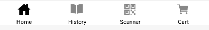

# Client
## Rappel du Sujet

Ce TP vise à la création d'une application d'achat d'objets, offrant une polyvalence d'utilisation et intégrant le système de paiement Stripe. Les utilisateurs ont la possibilité de scanner des codes-barres pour ajouter des articles au panier ou d'effectuer des ajouts manuels lorsque l'accès à la caméra n'est pas disponible. L'application interagit avec une API dédiée pour vérifier la disponibilité des articles.

Le panier de l'application offre une expérience complète, permettant aux utilisateurs de visualiser les articles scannés, de les ajuster en termes de quantité, de les supprimer si nécessaire et de procéder à un paiement sécurisé grâce à l'intégration du système Stripe. La sauvegarde locale du panier garantit aux utilisateurs la persistance de leurs sélections pour des achats futurs. Un historique des articles payés a également été envisagé pour offrir une traçabilité des transactions.

Sur le plan technique, le projet repose sur une structure utilisant une API FastAPI dédiée à l'intégration du système de paiement Stripe du côté serveur. Côté client, une application React Native est mise en place, exploitant la bibliothèque Expo.SQLite pour assurer la persistance des données. Cette approche permet de sauvegarder des informations cruciales telles que la quantité et l'identifiant de chaque article directement dans la base de données SQLite côté client.

Pour améliorer l'expérience utilisateur, un thème jour/nuit a été intégré, offrant une personnalisation visuelle en fonction des préférences de l'utilisateur.

## Configuration de l'application

Avant de lancer l'application, assurez-vous de suivre attentivement ces étapes :

1. **Création du fichier `.env` :**

   Avant de démarrer l'application, vous devez créer un fichier `.env` dans le répertoire client. Utilisez la commande suivante pour le créer :

   ```shell
   touch client/.env
   ```

2. **Configuration de la variable `USER_ID` :**

   ```env
   USER_ID=1254582568
   ```

   Remplacez `1254582568` par l'ID utilisateur réel 

3. **Adresse IP :**

   Il est essentiel de connaître l'adresse IP de votre machine sur le réseau, car l'émulateur a son propre réseau, différent de localhost. Obtenez cette adresse en utilisant la commande :

   ```shell
   ip a # ou ipconfig ou ifconfig
   ```

4. **Installation des dépendances :**

   Exécutez la commande suivante pour installer les dépendances nécessaires :

   ```shell
   npm i
   ```

5. **Lancement de l'application :**

   Utilisez la commande suivante pour démarrer l'application en spécifiant les variables d'environnement nécessaires :

   ```shell
   API_URL={API_URL} STRIPE_PK={STRIPE_PK} npm run android
   ```

   La clé publique `STRIPE_PK` est disponible depuis le tableau de bord de Stripe.


 ### Travail Réalisé

 ### Navigateur principal

  

 ### Thème Jour/Nuit

   Le choix du thème jour/nuit s'effectue depuis la page d'accueil en cliquant sur le bouton "Activer le Mode Jour". De même, lorsque l'application est en mode jour, il est possible d'activer le mode nuit en un simple clic.

  
   

### Scan de Codes-Barres
La page de scan des codes-barres assure la numérisation et la vérification. Chaque code-barres scanné génère un identifiant unique associé à un article. La première vérification s'effectue côté serveur via l'API, confirmant ainsi l'existence de l'article. En cas de correspondance, la page effectue une seconde vérification côté client dans la base de données SQLite pour déterminer si l'article est déjà présent dans le panier. Si c'est le cas, la quantité est mise à jour ; sinon, l'article est ajouté avec une quantité de 1. En revanche, si aucune correspondance n'est trouvée côté serveur, une alerte indique que l'article n'existe pas.

Pour tester le scan d'articles générant des identifiants, utilisez le fichier [exemple_cod_93.pdf.](./capture/exemple_cod_93.pdf)

    

 vérification via l'API : 
 
   

Vérification Côté Client dans la Base de Données SQLite : 

  

  


